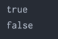

# Tipe Data Boolean

- Tipe data boolean adalah tipe data yang memiliki 2 nilai, yaitu benar dan salah
- Tipe data boolean di Java direpresentasikan dengan kata kunci boolean
- Nilai benar direpresentasikan dengan kata kunci true
- Nilai salah direpresentasikan dengan kata kunci false
- Default value untuk boolean adalah false

## Kode : Boolean
```java
boolean benar = true;
boolean salah = false;

System.out.println(benar);
System.out.println(salah);
```

#### Result : 
