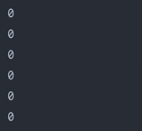
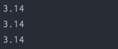
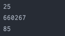
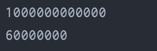

# Tipe Data Number

## Integer Number
Bisa dibilang bilangan bulat

| Tipe Data | Min            | Max  | Size | Default |
| --------- | -------------- | ---- | ---- | ------- |
| byte      | -128           | 127 | 1 bytes | 0 |
| short     | -32,768        | 32,767 | 2 bytes | 0 |
| int       | -2,147,483,648 | 2,147,483,647 | 4 bytes | 0 |
| long      | -9,223,372,036, 854,775,808 | 9,223,372,036, 854,775,807 | 8 bytes | 0 |

Kode :

```java
byte iniByte = 0;
short iniShort = 0;
int iniInt = 0;
long iniLong = 0;
long iniLong2 = 0L;
long iniLong3 = 0l;
```

#### Result : 


## Floating Point Number
Bisa dibilang bilangan pecahan

| Tipe Data | Min       | Max      | Size    | Default |
| --------- | --------- | -------- | ------- | ------- |
| float     | 3.4e-038  | 3.4e+038 | 4 bytes | 0.0     |
| double    | 1.7e-308  | 1.7e+308 | 8 bytes | 0.0     |

Kode :

```java
float iniFloat = 3.14F;
double iniDouble = 3.14;
```

#### Result :


## Kode : Literals
penulisan angka menggunakan format lain. contoh :
menambahkan 0x untuk hexa decimal dan menambahkan 0b untuk binary decimal

```java
int decimalInt = 25;
int hexInt = 0xA132B;
int binInt = 0b01010101;
```

#### Result : 


## Kode : Underscore
fitur ini mulai versi 7/8 bisa menambahkan pemisah untuk mempermudah membaca

```java
long balance = 1_000_000_000_000L;
long sum = 60_000_000;
```

#### Result : 


## Konversi Tipe Data Number
- Widening Casting (Otomatis) : <br/>  byte -> short -> int -> long -> float -> double
- Narrowing Casting (Manual) : <br/> double -> float -> long -> int -> short -> byte

Kode : 
```java
byte dByte = 10;
short dShort = dByte;
int dInt = dShort;
long dLong = dInt;
float dFloat = dLong;
double dDouble = dFloat;

float cFloat = (float) dDouble;
long cLong = (long) cFloat;
int cInt = (int) cLong;
short cShort = (short) cInt;
byte cByte = (byte) cShort;
```