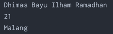
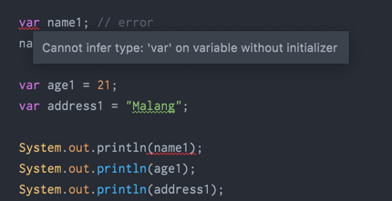
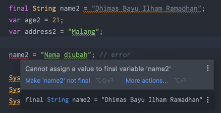

# Variable

- Variable adalah tempat untuk menyimpan data
- Java adalah bahasa static type, sehingga sebuah variable hanya bisa digunakan untuk menyimpan tipe data yang sama, tidak bisa berubah-ubah tipe data seperti di bahasa pemrograman PHP atau JavaScript
- Untuk membuat variable di Java kita bisa menggunakan nama tipe data lalu diikuti dengan nama variable nya
- Nama variable tidak boleh mengandung whitespace (spasi, enter, tab) dan tidak boleh seluruhnya number

## Kode : Variable
```java
String name;
name = "Dhimas Bayu Ilham Ramadhan";

int age = 21;
String address = "Malang";

System.out.println(name);
System.out.println(age);
System.out.println(address);
```
#### Result :


## Kata Kunci var
- Sejak versi Java 10, Java mendukung pembuatan variable dengan kata kunci var, sehingga kita tidak perlu menyebutkan tipe datanya
- Namun perlu diingat, saat kita menggunakan kata kunci var untuk membuat variable, kita harus menginisiasi value / nilai dari variable tersebut secara langsung

## Kode : Kata Kunci var
```java
var name; // error
name = "Dhimas Bayu Ilham Ramadhan";

var age = 21;
var address = "Malang";

System.out.println(name);
System.out.println(age);
System.out.println(address);
```
#### Result :


## Kata Kunci final

- Secara default, variable di Java bisa diubah-ubah nilainya
- Jika kita ingin membuat sebuah variable yang datanya tidak boleh diubah setelah pertama kali dibuat, kita bisa menggunakan kata kunci final
- Istilah variable sepertinya, banyak juga yang mengebutnya konstan

## Kode : Kata Kunci final
```java
final String name = "Dhimas Bayu Ilham Ramadhan";
var age = 21;
var address = "Malang";

name = "Nama diubah"; // error

System.out.println(name);
System.out.println(age);
System.out.println(address);
```

#### Result :
